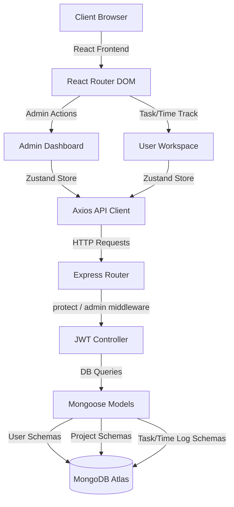

# ⏱️ TimeTrack — Project Time Tracker & Todo System

[](https://todolist-drab-tau.vercel.app/)
[](https://react.dev/)
[](https://nodejs.org/)
[](https://www.mongodb.com/)

An ultra-premium, full-stack **MERN** (MongoDB, Express, React, Node) application featuring time-auditing tracking, team dashboards, kanban task workflows, analytics reports, and a custom **interactive developer portfolio** integration.

---

## 🌟 Key Features

| Section | Highlights & Capabilities |
| :--- | :--- |
| 📊 **User Dashboard** | Log active working time, view task completion analytics, and manage recent project indicators. |
| ⏱️ **Time Logger** | Live time counters supporting both automated stopwatch tracking and manual log adjustments. |
| 📋 **Task Kanban** | Move task cards through workflows (Pending, In Progress, Completed, Cancelled) dynamically. |
| 📈 **Reports & Exports** | Generate interactive data charts using ApexCharts and export timesheets as Excel spreadsheets. |
| 🛡️ **Admin Controller** | Manage user accounts, extend/cancel subscriptions, reset credentials, and monitor system settings. |
| 🎨 **Interactive Portfolio** | Top-right floating workspace badge that opens a premium, particle-animated portfolio showcasing skills, experience timelines, and responsive project displays. |

---

## 🏗️ System Architecture



---

## 🚀 Local Development Setup

Follow these steps to launch both the frontend and backend servers concurrently:

### 1. Clone & Install Dependencies
Install packages for the backend and frontend client folders:
```bash
# Install root package-lock bindings
npm install

# Boostrap both project folders
npm run install:all
```

### 2. Configure Environment Variables
Create a `.env` file in the root workspace directory (`c:\todolist\.env`) and add the following keys:
```env
PORT=5000
MONGO_URI=your_mongodb_connection_string
JWT_SECRET=your_signing_secret_key

# SMTP configuration for email alerts
SMTP_HOST=smtp.gmail.com
SMTP_PORT=587
SMTP_USER=your_email@gmail.com
SMTP_PASS=your_app_password
SMTP_FROM="TimeTrack" <your_email@gmail.com>
```

### 3. Run Concurrently
Fire up the concurrently configured development script:
```bash
npm run dev
```
* Frontend runs on: **`http://localhost:5173/`**
* Backend APIs run on: **`http://localhost:5000/`**

---

## 🛡️ Production & Scaling

The project is configured for Vercel Serverless deployments with a standard `vercel.json` structure linking APIs and static frontend SPA routes:

```json
{
  "rewrites": [
    { "source": "/api/(.*)", "destination": "/api/server.js" },
    { "source": "/(.*)", "destination": "/client/dist/$1" }
  ]
}
```

* Deployments can be launched with: `vercel --prod -y`
* Includes Mongoose schema populated checking to ensure deleted accounts do not crash project filters.
